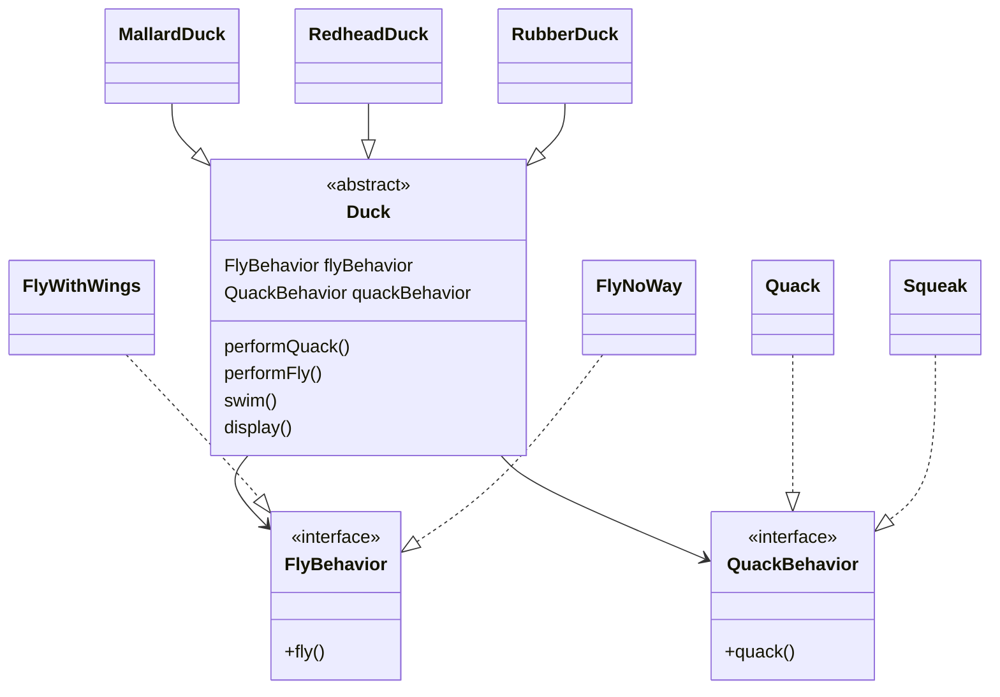
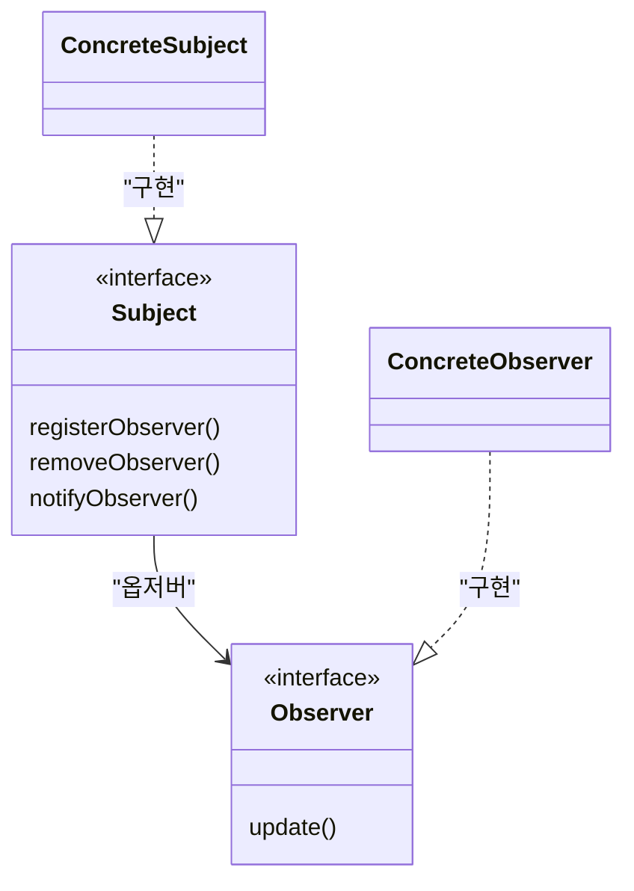
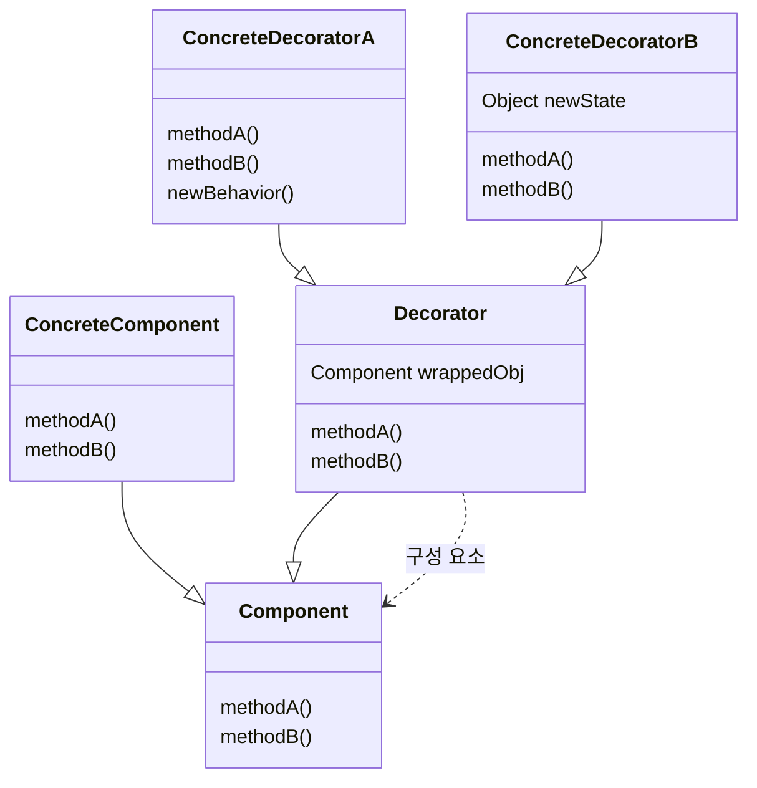
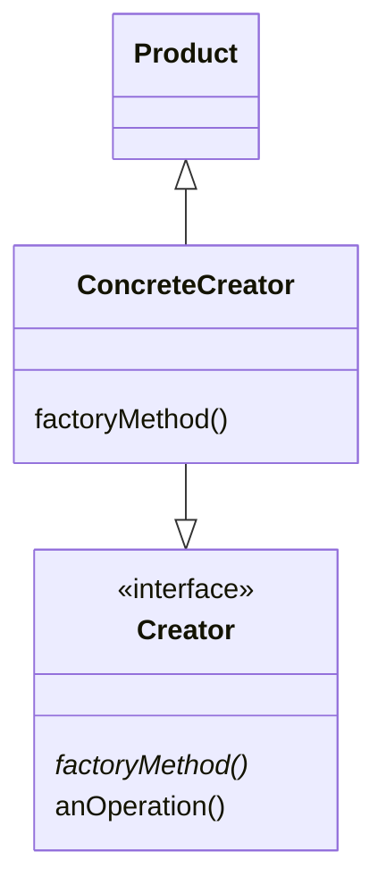
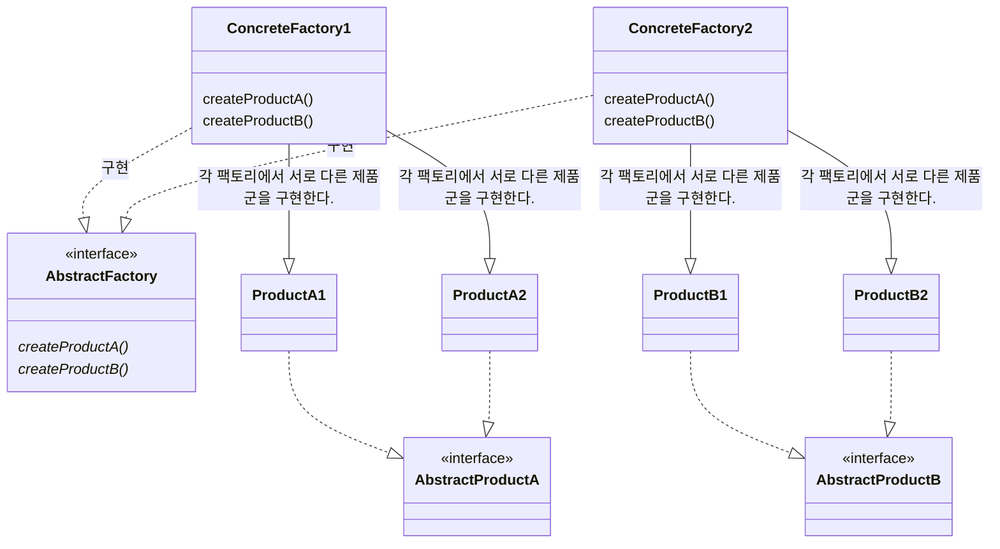
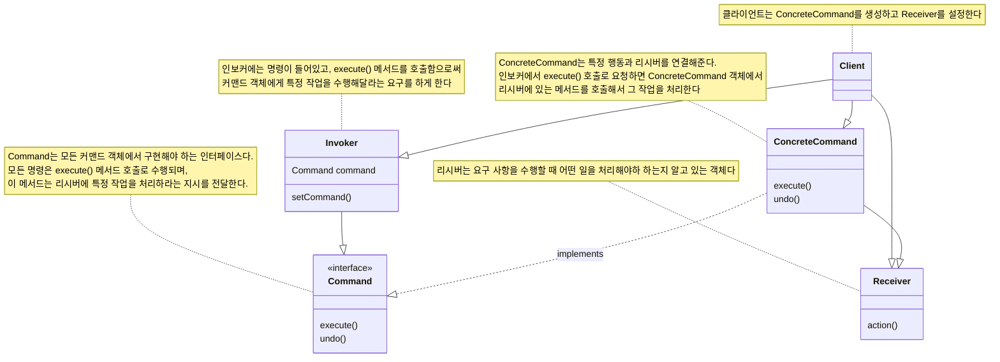
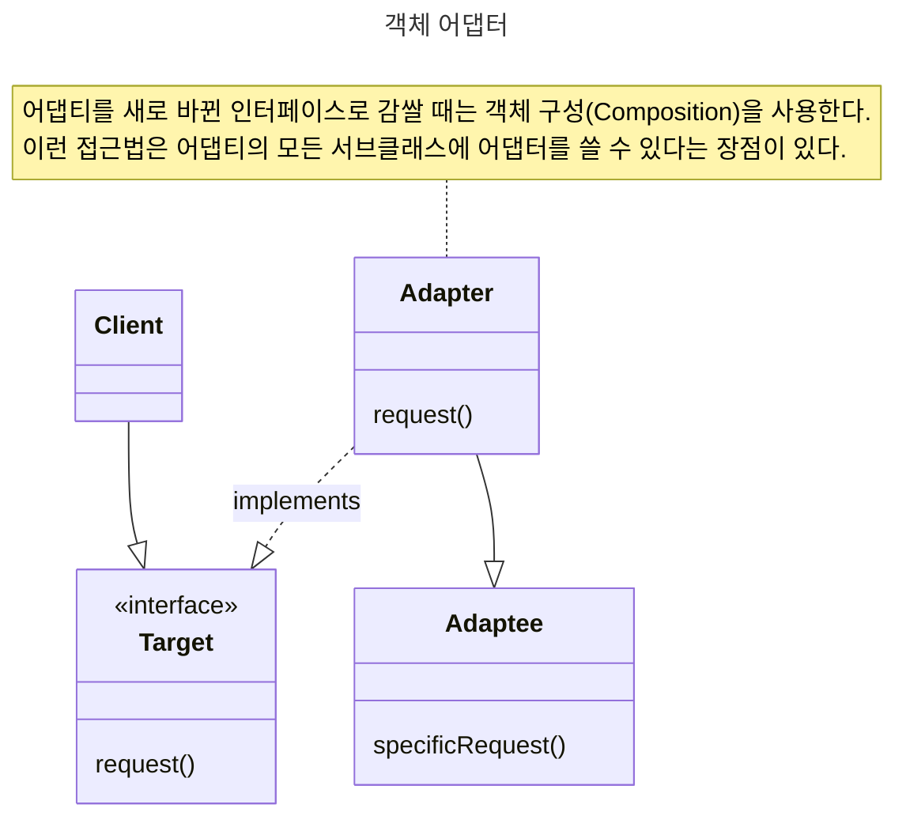
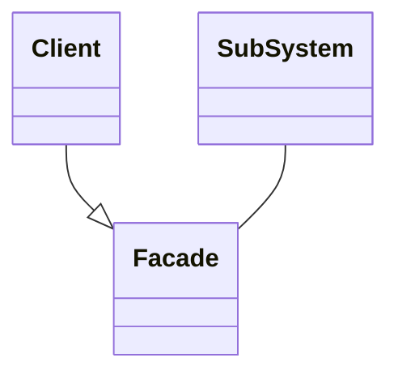

# 목차

--- 

> 1. [전략 패턴](#chapter01---전략-패턴strategy-pattern)
> 1. [옵저버 패턴](#chapter02---옵저버-패턴observer-pattern)
> 1. [데코레이터 패턴](#chapter03---데코레이터-패턴decorator-pattern)
> 1. [팩토리 패턴](#chapter04---팩토리-패턴factory-pattern)
> 1. [싱글턴 패턴](#chapter05---싱글턴-패턴singleton-pattern)
> 1. [커맨드 패턴](#chapter06---커맨드-패턴command-pattern)
> 1. [어댑트 패턴과 퍼사드 패턴](#chapter07---어댑터-패턴과-퍼사드-패턴adapter-pattern--pacade-pattern)
>   1. [어댑트 패턴](#어댑터-패턴adapter-pattern)
>   1. [퍼사드 패턴](#퍼사드-패턴facade-pattern)

---

## Chapter01 - 전략 패턴(strategy pattern)
전략 패턴(strategy pattern)은 알고리즘군을 정의하고 캡슐화해서 각각의 알고리즘군을 수정해서 쓸 수 있게 해준다.  
전략 패턴을 사용하면 클라이언트로부터 알고리즘을 분리해서 독립적으로 변경할 수 있다.  
> 1. 디자인 원칙: 애플리케이션에서 달라지는 부분을 찾아내고, 달라지지 않는 부분과 분리한다. (바뀌는 부분은 캡슐화->유연성 향상)
> 2. 디자인 원칙: 구현보다 인터페이스에 맞춰서 프로그래밍한다. (위임할 객체에게 맡기면 구체적으로 구현하지 않아도 된다.)
> 3. 디자인 원칙: 상속보다는 구성을 활용한다. (행동을 상속받는 대신 올바른 객체로 *구성*되게 한다.)  
  
- **"인터페이스에 맞춰서 프로그래밍한다"라는 말은 "상위 형식에 맞춰서 프로그래밍한다"라는 말이다.**
- 오리 클래스에는 행동을 **상속**받는 대신, 올바른 행동 객체로 **구성**되어 행동을 부여받는다.
  - 실행 시 행동을 동적으로 바꿀 수 있게되는 장점이 있다.


고민할 거리: 상속에는 상속 나름대로 문제가 있으며, 상속 외에도 재사용을 이룰 수 있는 여러 방법들이 있다.  
훌륭한 객체지향 디자인에는 재사용성, 확장성, 관리용이성이 있다.  
대부분의 패턴과 원칙은 소프트웨어 변경 문제와 연관되어 있다.  

---

## Chapter02 - 옵저버 패턴(observer pattern)
옵저버 패턴(observer pattern)은 한 객체의 상태가 바뀌면 그 객체에 의존하는 다른 객체에게 연락이 가고  
자동으로 내용이 갱신되는 방식으로 일대다(one-to-many) 의존성을 정의한다.  
> 1. 디자인 원칙: 상호작용하는 객체 사이에는 가능하면 느슨한 결합을 사용해야 한다.  

핵심 정리  
* subjects는 동일한 인터페이스를 써서 옵저버에게 연락한다.
* Observer 인터페이스를 구현하기만 하면 어떤 구상 클래스의 옵저버라도 패턴에 참여할 수 있다.
* subjects는 옵저버들이 Observer 인터페이스를 구현한다는 것을 제외하면 옵저버에 관해 전혀 모른다. -> 느슨한 결합
* 옵저버 패턴을 사용하면 subjects가 데이터를 보내거나(push) 옵저버가 데이터를 가져올 (pull)수 있다.
  * push 보다 pull을 사용하는게 대체로 더 좋다. (subjects가 확장될 때마다 getter만 추가하고, 필요한 데이터만 가져올 수 있도록 하면 된다.)
* 자바빈도 옵저버 패턴을 많이 사용한다.
* 옵저버 패턴은 여러 개의 주제와 메시지 유형이 있는 출판-구독 패턴과 친척이다.
* 옵저버 패턴은 자주 쓰이는 패턴으로 MVC 패턴에서 다시 나온다.


---

## Chapter03 - 데코레이터 패턴(decorator pattern)
데코레이터 패턴(decorator pattern)으로 객체에 추가 요소를 동적으로 더할 수 있다.  
데코레이터를 사용하면 서브클래스를 만들 떄 보다 훨씬 유연하게 기능을 확장할 수 있다.  
> 1. 디자인 원칙: 클래스는 확장에는 열려 있어야 하지만 변경에는 닫혀 있어야 한다. (OCP)    

데코레이터 패턴을 사용하면 자잘한 객체가 매우 많이 추가될 수 있고, 데코레이터를 너무 많이 사용하면 코드가 필요 이상으로 복잡해진다.  
구성 요소의 클라이언트는 데코레이터의 존재를 알 수 없다. 단, 클라이언트가 구성 요소의 구체적인 형식에 의존하는 경우는 예외다.  



---

## Chapter04 - 팩토리 패턴(factory pattern)
- 간단한 팩토리(Simple Factory)는 디자인 패턴이라기 보다는 프로그래밍에서 자주 쓰이는 **관용구**에 가깝다.
  - 사용하는 이유 : 팩토리에서 생산하는 제품에 해당하는 구상 클래스(피자)를 만들고 클라이언트로 넘기기 위해서
### 코드 자세히 들여다보기
```
abstract Product factoryMethod(String type) 
```
- abstract: 팩토리 메서드를 추상 메서드로 선언해서 서브 클래스가 객체 생성을 책임지도록 한다.
- Product: 팩토리 메서드는 특정 객체를 리턴하며, 그 객체는 보통 슈퍼 클래스가 정의한 메서드 내에서 쓰인다.
- factoryMethod: 팩토리 메서드는 클라이언트(슈퍼 클래스에 있는 orderPizze() 같은 코드)에서 실제로 생성되는 구상 객체가 무엇인지 알 수 없게 만든다.
- Params(String type): 팩토리 메서드를 만들 때 매개변수로 만들 객체 종류를 선택할 수도 있다.
- 핵심: 팩토리 메서드는 피자 객체를 만드는 방법을 캡슐화한다.

### 팩토리 메서드 패턴의 정의
> 팩토리 메서드 패턴(Factory Method Pattern)에서는 객체를 생성할 때 필요한 인터페이스를 만든다.  
> 어떤 클래스의 인스턴스를 만들지는 서브클래스에서 결정한다.  
> 팩토리 메서드 패턴을 사용하면 클래스 인스턴스를 만드는 일을 서브클래스에게 맡기게 된다.

다시 말하면, 사용하는 서브클래스에 따라 생산되는 객체 인스턴스가 결정된다.  
팩토리 메서드 패턴을 사용함으써, Creator 클래스가 ConcreteProduct와 느슨하게 결합되어 있을 수 있다.  

> 1. 디자인 원칙: 추상화된 것에 의존하게 만들고 구상 클래스에 의존하지 않게 만든다. (의존성 뒤집기 원칙; Dependency Inversion Principle)

PizzaStore의 행동은 Pizza에 의해 정의되므로 PizzaStore는 고수준 구성 요소이다.  
PizzaStore에서 사용하는 Pizza 객체(예를 들면, NYStyleCheesePizza클래스)는 저수준 구성 요소이다.  
고수준 구성 요소는 저수준 구성 요소에 의존하면 안되고, 항상 추상화에 의존하게 만들어야 한다.  

### 의존성 뒤집기 원칙을 지키는 방법 3가지
- 변수에 구상 클래스의 레퍼런스를 저장하지 말자.
  - `new` 연산자를 사용하면 구상 클래스의 레퍼런스를 사용하게 된다.
  - 그러니 팩토리를 써서 구상 클래스의 레퍼런스를 변수에 저장하는 일을 미리 방지하자.
- 구상 클래스에서 유도된 클래스를 만들지 말자.
  - 구상 클래스에서 유도된 클래스를 만들면 특정 구상 클래스에 의존하게 된다.
  - 인터페이스나 추상 클래스처럼 추상화된 것으로부터 클래스를 만들어야 한다.
- 베이스 클래스에서 이미 구현되어 있는 메서드를 오버라이드하지 말자.
  - 이미 구현되어 있는 메서드를 오버라이드한다면 베이스 클래스가 제대로 추상화되지 않는다.
  - 베이스 클래스에서 메서드를 정의할 때는 모든 서브클래스에서 공유할 수 있는 것만 정의해야 한다.
> 이 가이드 라인은 항상 지켜야하는 규칙이 아니라, 우리가 지향해야 할 바를 알려줄 뿐이다.

### 추상 팩토리 패턴의 정의
> 추상 팩토리 패턴(Abstract Factory Pattern)은 구상 클래스에 의존하지 않고도
> 서로 연관되거나 의존적인 객체로 이루어진 제품군을 생산하는 인터페이스를 제공한다.
> 구상 클래스는 서브클래스에서 만든다.

추상 팩토리 패턴을 사용하면 클라이언트에서 추상 인터페이스로 일련의 제품을 공급받을 수 있다.  
이때, 실제로 어떤 제품이 생산되는지는 전혀 알 필요가 없다.  
따라서 클라이언트와 팩토리에서 생산되는 제품을 분리할 수 있다.  



### 팩토리 메서드 패턴과 추상 팩토리 패턴의 공통점과 차이점
#### 공통점
- 애플리케이션을 특정 구현으로부터 분리하는 일을 한다.
  - 즉, 느슨한 결합을 도와준다.
- 객체를 생성하는 일을 한다.

#### 차이점
##### 팩토리 메서드 패턴
- 객체를 생성할 때 클래스를 확장(상속;extends)하고 팩토리 메서드를 오버라이드한다.
- 팩토리 메서드를 사용하는 이유는 서브클래스로 객체를 만들기 위해서이다. (구상 형식을 서브클래스에서 처리해준다.)
##### 추상 팩토리 패턴
- 객체를 생성할 때 객체 구성(composition)으로 만든다. 즉, 제품군을 만드는 추상 형식을 사용한다.
  ```java
    public interface PizzaIngredientFactory {

    public Dough createDough();

    public Sauce createSauce();

    public Cheese createCheese();

    public Veggies[] createVeggies();

    public Pepperoni createPepperoni();

    public Clams createClam();
    }
    ```
- 연관된 제품을 하나로(제품군으로) 묶을 수 있는 장점이 있다.
- 새로운 제품을 추가하려면 인터페이스를 변경해야하는 단점이 있다.

---

## Chapter05 - 싱글턴 패턴(singleton pattern)
싱글턴 패턴(Singleton Pattern)은 클래스 인스턴스를 하나만 만들고, 그 인스턴스로의 전역 접근을 제공한다.  
- 싱글턴 패턴을 실제로 적용할 때는 클래스에서 하나뿐인 인스턴스를 관리하도록 만들면 된다.  
- 그리고 다른 어떤 클래스에서도 자신의 인스턴스를 추가로 만들지 못하게 해야 한다.  
- 어디서든 그 인스턴스에 접근할 수 있도록 전역 접근 지점을 제공한다.
- Lazyinstantitaion(게으른 방식의 인스턴스 생성)으로 생성되도록 구현할 수도 있다. 이떄 자원을 많이 잡아먹는 인스턴스에 효과적이다.

### 싱글턴 구현 방법
#### 고전적인 방법(사용하면 안됨)
```java
public class Singleton {
    private static Singleton uniqueInstance;
    
    private Singleton() {}

  public static Singleton getInstance() {
    if (uniqueInstance == null) {
      uniqueInstance = new Singleton();
    }
    return uniqueInstance;
  }
}
```

#### 멀티스레딩 문제를 해결한 구현 방법
##### 1. getInstance()를 동기화하는 방법(성능이 100배 저하)
```java
public class Singleton {
    private static Singleton uniqueInstance;
    
    private Singleton() {}

  public static synchronized Singleton getInstance() {
    if (uniqueInstance == null) {
      uniqueInstance = new Singleton();
    }
    return uniqueInstance;
  } 
}
```

##### 2. 처음부터 만드는 방법
```java
public class Singleton {
    private static Singleton uniqueInstance = new Singleton();
    
    private Singleton() {}

  public static synchronized Singleton getInstance() {
    return uniqueInstance;
  } 
}
```

##### 3. DCL(Double-Checked Locking)을 써서 getInstance()에서 동기화되는 부분을 줄이는 방법
```java
public class Singleton {
    private volatile static Singleton uniqueInstance;
    
    private Singleton() {}

  public static synchronized Singleton getInstance() {
    if (uniqueInstance == null) {
      synchronized (Singleton.class) {
        if (uniqueInstance == null) {
          uniqueInstance = new Singleton();
        }
      }
    }
    return uniqueInstance;
  } 
}
```

#### 어떤 방법을 쓰는게 맞을까?
1. getInstance()의 속도가 그리 중요하지 않다면? 그냥 둔다(동기화하는 방법을 사용)
2. 애플리케이션에서 Singleton의 인스턴스를 생성하고 계속 사용하거나, 실행 중에 수시로 만들고 관리가 성가시면 처음부터 생성한다.
3. DCL: 인스턴스가 생성되어 있는지 확인한 다음 생성되어 있지 않았을 때만 동기화하고, 나중엔 동기화하지 않아도 된다. (Java 1.4 이전은 사용 불가)

#### 싱글턴의 문제점
- 클래스 로링 문제 : 클래스 로더마다 서로 다른 네임스페이스를 정의하기에 클래스 로더가 2개 이상이면 각 클래스 로더마다 한 번씩 로딩할 수도 있다.
- 리플렉션, 직렬화, 역직렬화 문제
- 느슨한 결합 원칙에 위배
- 서브클래스를 만들면 모든 서브클래스가 똑같은 인스턴스 변수를 공유해서 부작용 발생이 높다.

### 결론: Enum을 사용하자
```java
public enum Singleton {
    UNIQUE_INSTANCE;
}

public class SingletonClient {
  public static void main(String[] args) {
    Singleton singleton = Singleton.UNIQUE_INSTANCE;
  }
}
```
- Enum을 사용하면 동기화 문제, 클래스 로딩 문제, 리플렉션, 직렬화와 역직렬화 문제를 해결할 수 있다!  

---

## Chapter06 - 커맨드 패턴(command pattern)
커맨드 패턴(Command Pattern)을 사용하면 요청 내역을 객체로 캡술화해서 객체를 서로 다른 요청 내역에 따라 매개변수화 할 수 있다.  
이러면 요청을 큐에 저장하거나 로그로 기록하거나 작업 취소 기능을 사용할 수 있다.  
  
밖에서 볼 때는 어떤 객체가 리시버 역할을 하는지, 그 리시버가 어떤 일을 하는지 알 수 없다.  
그냥 `execute()` 메서드를 호출하면 해당 요청이 처리된다는 사실만 알 수 있다.  


- 작업 취소를 할 때 히스토리 기능의 구현 방법(UNDO 버튼을 여러 번 누를 수 있도록 하는 방법)
  -  전에 실행한 커맨드 자체를 스택에 넣고, UNDO 버튼을 누를 때마다 인보커에서 스택 맨 위에 있는 항목을 꺼내서 `undo()` 메서드를 호출하면 된다.
### 핵심정리
> - 커맨드 패턴을 사용하면 요청하는 객체와 요청을 수행하는 객체를 분리할 수 있다.
> - 분리하는 과정의 중심에 커맨드 객체가 있으며, 이 객체가 행동이 들어있는 리시버를 캡술화한다.
> - 인보커는 무언가 요청을 할 때 커맨드 객체의 `execute()` 메서드를 호출하면 된다. `execute()` 메서드는 리시버에 있는 행동을 호출한다.
> - 커맨드는 인보커를 매개변수화 할 수 있다. 실행 중에 동적으로 매개변수화를 설정할 수도 있다.
> - `execute()` 메서드가 마지막으로 호출되기 전의 상태로 되돌리는 작업 취소 메서드를 구현하면 커맨드 패턴으로 작업 취소 기능을 구현할 수도 있다.
> - 매크로 커맨드는 커맨드를 확장해서 여러 개의 커맨드를 한 번에 호출할 수 있게 해 주는 가장 간편한 방법이다.
> - 매크로 커맨드로도 작업 취소 기능을 구현할 수 있다.
> - 프로그래밍을 하다 보면 요청을 스스로 처리하는 '스마트'커맨드 객체를 사용하는 경우도 종종 있다.
> - 커맨드 패턴을 활용해서 로그 및 트랜잭션 시스템을 구현할 수 있다.

---

## Chapter07 - 어댑터 패턴과 퍼사드 패턴(adapter pattern & facade pattern)

### 어댑터 패턴(adapter pattern)
어댑터 패턴(Adapter Pattern)은 특정 클래스 인터페이스를 클라이언트에서 요구하는 다른 인터페이스로 변환한다.  
인터페이스가 호환되지 않아 같이 쓸 수 없었던 클래스를 사용할 수 있게 도와준다.  

#### 클라이언트에서 어탭터를 사용하는 방법
1. 클라이언트에서 타깃 인터페이스로 메서드를 호출해서 어댑터에 요청을 보낸다.
2. 어댑터는 어댑티(adaptee) 인터페이스로 그 요청을 어댑티에 관한 메서드 호출로 변환한다.
3. 클라이언트는 호출 결과를 받긴 하지만 중간에 어댑터가 있다는 사실을 모른다.



### 퍼사드 패턴(facade pattern)
퍼사드 패턴(Facade Pattern)은 서브시스템에 있는 일련의 인터페이스를 통합 인터페이스로 묶어 준다.  
또한 고수준 인터페이스도 정의하므로 서브시스템을 더 편리하게 사용할 수 있다.  



> 1. 디자인 원칙: **최소 지식 원칙(Principle of Least Knowledge)** - 진짜 절친에게만 이야기해야 한다.

시스템을 디자인할 떄 어떤 객체든 그 객체와 상호작용을 하는 클래스의 개수와 상호작용 방식에 주의를 기울여야 한다는 뜻.  
이 원칙을 잘 따르면 여러 클래스가 복잡하게 얽혀 있어서, 시스템의 한 부분을 변경했을 때 다른 부분까지 줄줄이 고쳐야 하는 상황을 미리 방지할 수 있다.  

#### 친구를 만들지 않고 다른 객체에 영향력 행사하기
> 친구를 만들지 않는 4개의 가이드 라인
> 1. 객체 자체
> 2. 메서드에 매개변수로 전달된 객체
> 3. 메서드를 생성하거나 인스턴스를 만든 객체
> 4. 객체에 속하는 구성 요소 (A Has a B)

```java
// 원칙을 따르지 않은 경우
public float getTemp() {
    Thermometer thermometer = station.getThermometer();
    return thermometer.getTemperature();
}
```

```java
// 원칙을 따르는 경우: thermometer에 요청을 전달하는 메서드를 Station클래스에 추가
public float getTemp() {
    return station.getTemperature();
}
```

```java
/**
 * 최소 지식 원칙을 따르면서 메서드를 호출하는 올바른 방법의 예
 */
public class Car {
    Engine engine;
    
    public Car() {
        // 엔진 초기화    
    }

  public void start(Key key) {
        Doors doors = new Doors(); // 새로운 객체 생성
        boolean authorized = key.turns(); // 매개변수로 전달된 객체의 메서드는 호출해도 된다.
        if (authorized) {
            engine.start(); // 이 객체의 구성 요소를 대상으로 메서드를 호출해도 된다.
            updateDashboardDisplay(); // 이 객체의 구성 요소를 대상으로 메서드를 호출해도 된다.
            doors.lock(); // 이 객체의 구성 요소를 대상으로 메서드를 호출해도 된다.
        }
  }
  
  public void updateDashboardDisplay() {
        // 디스플레이 갱신
  }
}
```
`디미터의 법칙 == 최소 지식의 원칙` 이라고 할 수 있다.  
하지만 어떤 원칙도 법칙이라고 할 수 없다. 모든 원칙은 상황에 따라서 적절하게 따라야 한다.  
디자인마다 장단점(추상화 vs 속도, 공간 vs 시간 등)이 있다.  
따라서 가이드라인과는 별개로 모든 요인을 살펴본 다음 원칙을 적용해야 한다.  

#### 최소 지식의 원칙의 단점
메서드 호출을 처리하는 래퍼(Wrapper) 클래스를 더 만들어야 할 수도 있다.  
그러면 시스템이 복잡해지고, 개발 시간도 늘어나고, 성능도 떨어진다.
